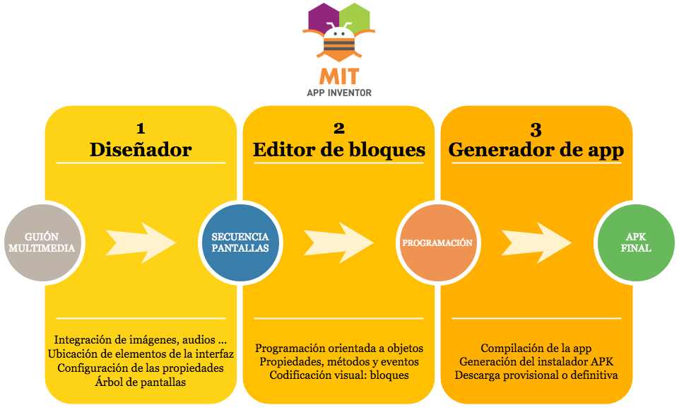

App inventor es un entorno de programación que permite crear aplicaciones móviles de forma muy sencilla, por lo que es accesible a todo el mundo, incluso a los niños. App inventor está diseñado para programar aplicaciones sencillas pero totalmente funcionales para smartphones y tablets de dispositivos Android o iOS.

El objetivo de App Inventor es democratizar el desarrollo de software, permitiendo a los jóvenes dejar de ser consumidores pasivos de tecnología para convertirse en creadores activos de tecnología. 

Para ello, App Inventor se ha creado como un software de programación profundamente visual e intuitivo. Funciona con un lenguaje de programación basado en bloques

## Diagrama de flujo 

