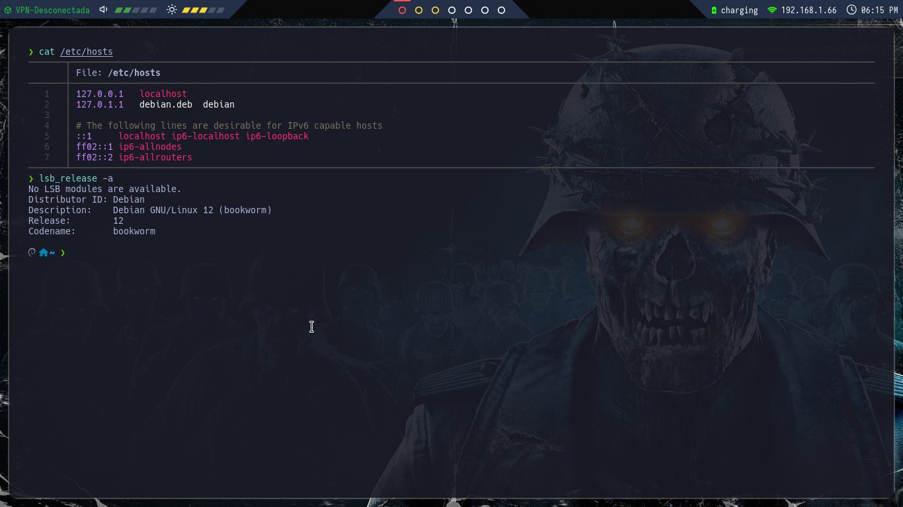

En este caso compartire mis archivos de configuracion (polybar, kitty, bspwm, rofi, sxhkd, picom)
Algunos los pondre dentro de este post y otros estaran dento de un drive ya que son muchos archivos 
tambien mostrare su configuracion y localizacion tratando de reducir la cantidad de dudas que puedan existir. 

## Mi sistema operativo es un debian 12 Come libros ( TOY STORY)

```bash
❯ lsb_release -a
No LSB modules are available.
Distributor ID:	Debian
Description:	Debian GNU/Linux 12 (bookworm)
Release:	12
Codename:	bookworm
```

## Archivo bspwmrc

Este sería el archivo de configuración situado bajo `~/.config/bspwm`:

```bash
#! /bin/sh

sxhkd &
#compton --config ~/.config/compton/compton.conf &
picom &
feh --bg-fill ~/Descargas/Zombie-Army-4-Dead-War-1080P-Wallpaper.jpg &
wmname LG3D &
~/.config/polybar/cuts/launch.sh &

bspc config pointer_modifier mod1

bspc monitor -d I II III IV V VI VII 

bspc config border_width         2
bspc config window_gap          12

bspc config split_ratio          0.52
bspc config borderless_monocle   true
bspc config gapless_monocle      true

bspc rule -a Gimp desktop='^8' state=floating follow=on
bspc rule -a Chromium desktop='^2'
bspc rule -a mplayer2 state=floating
bspc rule -a Kupfer.py focus=on
bspc rule -a Screenkey manage=off
bspc rule -a burp-StartBurp: state=floating#! /bin/sh

```

## Archivo bspwm resize

Este sería el archivo de configuración situado bajo `~/.config/bspwm/scripts/`:


```bash
#!/usr/bin/env bash

if bspc query -N -n focused.floating > /dev/null; then
	step=20
else
	step=100
fi

case "$1" in
	west) dir=right; falldir=left; x="-$step"; y=0;;
	east) dir=right; falldir=left; x="$step"; y=0;;
	north) dir=top; falldir=bottom; x=0; y="-$step";;
	south) dir=top; falldir=bottom; x=0; y="$step";;
esac

bspc node -z "$dir" "$x" "$y" || bspc node -z "$falldir" "$x" "$y"
```

## Archivo picom.conf

Este sería el archivo de configuración situado bajo `~/.config/picom/`:

```bash
shadow = false;
shadow-radius = 7;
shadow-offset-x = -7;
shadow-offset-y = -7;
shadow-exclude = [
  "name = 'Notification'",
  "class_g = 'Conky'",
  "class_g ?= 'Notify-osd'",
  "class_g = 'Cairo-clock'",
  "_GTK_FRAME_EXTENTS@:c"
];
fading = true
fade-in-step = 0.03;
fade-out-step = 0.03;
inactive-opacity = 0.8;
frame-opacity = 0.5;
inactive-opacity-override = false;
 active-opacity = 1.0;
focus-exclude = [ "class_g = 'Cairo-clock'" ];
backend = "xrender";
vsync = true
mark-wmwin-focused = true;
mark-ovredir-focused = false;
detect-rounded-corners = true;
detect-client-opacity = true;
refresh-rate = 0
detect-transient = true
detect-client-leader = true
use-damage = true
log-level = "warn";
wintypes:
{
  tooltip = { fade = true; shadow = true; opacity = 0.75; focus = true; full-shadow = false; };
  dock = { shadow = false; }
  dnd = { shadow = false; }
  popup_menu = { opacity = 0.8; }
  dropdown_menu = { opacity = 0.8; }
};

corner-radius = 15.0;
rounded-corners-exclude = [
  #"window_type = 'normal'",
  #"class_g = 'rofi'",
  #"class_g = 'XTerm'",
  "class_g = 'Polybar'",
  #"class_g = 'code-oss'",
  #"class_g = 'TelegramDesktop'",
  "class_g = 'firefox'"
  #"class_g = 'Thunderbird'"
];

```

## Archivo sxhkdrc

Este sería el archivo de configuración situado bajo `~/.config/sxhkd`:

```bash
# terminal emulator
super + Return
	kitty

# program launcher
super + d
  ~/.config/polybar/cuts/scripts/launcher.sh

# make sxhkd reload its configuration files:
super + Escape
	pkill -USR1 -x sxhkd

# quit/restart bspwm
super + alt + {q,r}
	bspc {quit,wm -r}

# close and kill
super + {_,shift + }w
	bspc node -{c,k}

# alternate between the tiled and monocle layout
super + m
	bspc desktop -l next

# send the newest marked node to the newest preselected node
super + y
	bspc node newest.marked.local -n newest.!automatic.local

# swap the current node and the biggest window
super + g
	bspc node -s biggest.window

# set the window state
super + {t,shift + t,s,f}
	bspc node -t {tiled,pseudo_tiled,floating,fullscreen}

# set the node flags
super + ctrl + {m,x,y,z}
	bspc node -g {marked,locked,sticky,private}

# focus the node in the given direction
super + {_,shift + }{Left,Down,Up,Right}
	bspc node -{f,s} {west,south,north,east}

# focus the node for the given path jump
super + {p,b,comma,period}
	bspc node -f @{parent,brother,first,second}

# focus the next/previous window in the current desktop
super + {_,shift + }c
	bspc node -f {next,prev}.local.!hidden.window

# focus the next/previous desktop in the current monitor
super + bracket{left,right}
	bspc desktop -f {prev,next}.local

# focus the last node/desktop
super + {grave,Tab}
	bspc {node,desktop} -f last

# focus the older or newer node in the focus history
super + {o,i}
	bspc wm -h off; \
	bspc node {older,newer} -f; \
	bspc wm -h on

# focus or send to the given desktop
super + {_,shift + }{1-9,0}
	bspc {desktop -f,node -d} '^{1-9,10}'

# preselect the direction
super + ctrl + {Left,Down,Up,Right}
	bspc node -p {west,south,north,east}

# preselect the ratio
super + ctrl + {1-9}
	bspc node -o 0.{1-9}

# cancel the preselection for the focused node
super + ctrl + space
	bspc node -p cancel

# cancel the preselection for the focused desktop
super + ctrl + shift + space
	bspc query -N -d | xargs -I id -n 1 bspc node id -p cancel

# move a floating window
super + ctl + {Left,Down,Up,Right}
	bspc node -v {-20 0,0 20,0 -20,20 0}


# Custom move/resize
alt + super + {Left,Down,Up,Right}
    ~/.config/bspwm/scripts/bspwm_resize {west,south,north,east}

#open firefox

super + shift +f 
	firejail /usr/bin/firefox-esr

super + shift + b
	firejail /usr/bin/chromium

#Volume
XF86AudioRaiseVolume
    pactl set-sink-volume 0 +10%
XF86AudioLowerVolume
    pactl set-sink-volume 0 -10%
XF86AudioMute
    pactl set-sink-mute 0 toggle

#Brightness control
XF86MonBrightnessUp
	brightnessctl set +10%
XF86MonBrightnessDown
	brightnessctl set 10%-

#Slimlock keys
super + shift + x
	slimlock
	
```

## Archivo zshrc

Este sería el archivo de configuración situado bajo `~/.zshrc`:

```bash
# Fix the Java Problem
export _JAVA_AWT_WM_NONREPARENTING=1

# Enable Powerlevel10k instant prompt. Should stay at the top of ~/.zshrc.
if [[ -r "${XDG_CACHE_HOME:-$HOME/.cache}/p10k-instant-prompt-${(%):-%n}.zsh" ]]; then
  source "${XDG_CACHE_HOME:-$HOME/.cache}/p10k-instant-prompt-${(%):-%n}.zsh"
fi

# Set up the prompt

autoload -Uz promptinit
promptinit
prompt adam1

setopt histignorealldups sharehistory

# Use emacs keybindings even if our EDITOR is set to vi
bindkey -e

# Keep 1000 lines of history within the shell and save it to ~/.zsh_history:
HISTSIZE=1000
SAVEHIST=1000
HISTFILE=~/.zsh_history

# Use modern completion system
autoload -Uz compinit
compinit

zstyle ':completion:*' auto-description 'specify: %d'
zstyle ':completion:*' completer _expand _complete _correct _approximate
zstyle ':completion:*' format 'Completing %d'
zstyle ':completion:*' group-name ''
zstyle ':completion:*' menu select=2
eval "$(dircolors -b)"
zstyle ':completion:*:default' list-colors ${(s.:.)LS_COLORS}
zstyle ':completion:*' list-colors ''
zstyle ':completion:*' list-prompt %SAt %p: Hit TAB for more, or the character to insert%s
zstyle ':completion:*' matcher-list '' 'm:{a-z}={A-Z}' 'm:{a-zA-Z}={A-Za-z}' 'r:|[._-]=* r:|=* l:|=*'
zstyle ':completion:*' menu select=long
zstyle ':completion:*' select-prompt %SScrolling active: current selection at %p%s
zstyle ':completion:*' use-compctl false
zstyle ':completion:*' verbose true

zstyle ':completion:*:*:kill:*:processes' list-colors '=(#b) #([0-9]#)*=0=01;31'
zstyle ':completion:*:kill:*' command 'ps -u $USER -o pid,%cpu,tty,cputime,cmd'
source ~/powerlevel10k/powerlevel10k.zsh-theme

# To customize prompt, run `p10k configure` or edit ~/.p10k.zsh.
[[ -f ~/.p10k.zsh ]] && source ~/.p10k.zsh

# Manual configuration

PATH=/root/.local/bin:/snap/bin:/usr/sandbox/:/usr/local/bin:/usr/bin:/bin:/usr/local/games:/usr/games:/usr/share/games:/usr/local/sbin:/usr/sbin:/sbin:/usr/local/bin:/usr/bin:/bin:/usr/local/games:/usr/games

# Manual aliases
alias ll='lsd -lh --group-dirs=first'
alias la='lsd -a --group-dirs=first'
alias l='lsd --group-dirs=first'
alias lla='lsd -lha --group-dirs=first'
alias ls='lsd --group-dirs=first'
alias cat='batcat'

[ -f ~/.fzf.zsh ] && source ~/.fzf.zsh

# Plugins
source /usr/share/zsh-syntax-highlighting/zsh-syntax-highlighting.zsh
source /usr/share/zsh-autosuggestions/zsh-autosuggestions.zsh
source /usr/share/zsh-sudo/sudo.plugin.zsh

# Functions
function mkt(){
	mkdir {nmap,content,exploits,scripts}
}

# Extract nmap information
function extractPorts(){
	ports="$(cat $1 | grep -oP '\d{1,5}/open' | awk '{print $1}' FS='/' | xargs | tr ' ' ',')"
	ip_address="$(cat $1 | grep -oP '\d{1,3}\.\d{1,3}\.\d{1,3}\.\d{1,3}' | sort -u | head -n 1)"
	echo -e "\n[*] Extracting information...\n" > extractPorts.tmp
	echo -e "\t[*] IP Address: $ip_address"  >> extractPorts.tmp
	echo -e "\t[*] Open ports: $ports\n"  >> extractPorts.tmp
	echo $ports | tr -d '\n' | xclip -sel clip
	echo -e "[*] Ports copied to clipboard\n"  >> extractPorts.tmp
	cat extractPorts.tmp; rm extractPorts.tmp
}

# Set 'man' colors
function man() {
    env \
    LESS_TERMCAP_mb=$'\e[01;31m' \
    LESS_TERMCAP_md=$'\e[01;31m' \
    LESS_TERMCAP_me=$'\e[0m' \
    LESS_TERMCAP_se=$'\e[0m' \
    LESS_TERMCAP_so=$'\e[01;44;33m' \
    LESS_TERMCAP_ue=$'\e[0m' \
    LESS_TERMCAP_us=$'\e[01;32m' \
    man "$@"
}

# fzf improvement
function fzf-lovely(){

	if [ "$1" = "h" ]; then
		fzf -m --reverse --preview-window down:20 --preview '[[ $(file --mime {}) =~ binary ]] &&
 	                echo {} is a binary file ||
	                 (bat --style=numbers --color=always {} ||
	                  highlight -O ansi -l {} ||
	                  coderay {} ||
	                  rougify {} ||
	                  cat {}) 2> /dev/null | head -500'

	else
	        fzf -m --preview '[[ $(file --mime {}) =~ binary ]] &&
	                         echo {} is a binary file ||
	                         (bat --style=numbers --color=always {} ||
	                          highlight -O ansi -l {} ||
	                          coderay {} ||
	                          rougify {} ||
	                          cat {}) 2> /dev/null | head -500'
	fi
}

function rmk(){
	scrub -p dod $1
	shred -zun 10 -v $1
}

# Finalize Powerlevel10k instant prompt. Should stay at the bottom of ~/.zshrc.
(( ! ${+functions[p10k-instant-prompt-finalize]} )) || p10k-instant-prompt-finalize

```

## Archivos de configuracion del polybar

- [Temas de polybar](https://github.com/adi1090x/polybar-themes.git)

Una vez clonado el repositorio teclearemos los siguientes comandos para darle pemisos y proceder a su instalacion
```bash
cd polybar-themes
chmod +x setup.sh
./setup.sh
```

Con esto tendremos instalados una infinidad de themas para nuestro polybar pero el que nos importa 

Esta bajo la ruta `~/.config/polybar/cuts/`;

para poder tener el tema deseado tendremos que descargar los siguientes archivos

- [Archivos de configuracion en zip](https://drive.google.com/file/d/1s5ex69xZW1keHezjG06ygQw2bfLMW7v7/view?usp=drive_link)

Una vez descargados los archivos tendremos que teclear los siguientes comandos para tener esta configuracion

```bash
rm -r ~/.config/polybar/cuts/
cp -r cuts ~/.config/polybar/
```

## El siguiente punto es colocar los scripts para nuestro polybar 

Situados en `~/.config/bin`

## Modulo battery.sh
Con el siguiente contenido

```bash

#!/bin/bash

if [ "$(acpi | awk '{print $3}' | tr -d ',')" != "Discharging" ]; then

	echo -e "%{F#27FF00} %{F#FFFFFF}$(acpi | awk '{print $4}' | tr -d ',')%{u-}"
else
	echo -e "%{F#FF0000} %{F#FFFFFF}$(acpi | awk '{print $4}' | tr -d ',')%{u-}"
fi
```

## Modulo ethernet_status.sh

Con el siguiente contenido

```bash
#!/bin/bash

echo -e "%{F#27FF00} %{F#FFFFFF}$(/usr/sbin/ifconfig wlp1s0 2>/dev/null| grep "inet " | awk '{print $2}')%{u-}"

```

En esta parte es indispensable identificar el nombre de nuestra tarjeta de red, ya que si no lo sabemos nos va a tirar un error el script
¿Como identificamos el nombre de nuestra tarjeta de red?.
De la siguiente manera 
```bash
❯ ip address
1: lo: <LOOPBACK,UP,LOWER_UP> mtu 65536 qdisc noqueue state UNKNOWN group default qlen 1000
    link/loopback 00:00:00:00:00:00 brd 00:00:00:00:00:00
    inet 127.0.0.1/8 scope host lo
       valid_lft forever preferred_lft forever
    inet6 ::1/128 scope host noprefixroute 
       valid_lft forever preferred_lft forever
2: wlp1s0: <BROADCAST,MULTICAST,UP,LOWER_UP> mtu 1500 qdisc noqueue state UP group default qlen 1000
    link/ether d8:f3:bc:cc:0c:9b brd ff:ff:ff:ff:ff:ff
    inet 192.168.1.66/24 brd 192.168.1.255 scope global dynamic noprefixroute wlp1s0
       valid_lft 84215sec preferred_lft 84215sec
    inet6 fd14:d11f:fb9a:2100:3eae:2454:d130:a5ed/64 scope global dynamic noprefixroute 
       valid_lft 6740sec preferred_lft 3140sec
    inet6 fe80::1068:8ba9:7a78:4482/64 scope link noprefixroute 
       valid_lft forever preferred_lft forever

```
En este caso nuestra interfaz se llama `wlp1s0` (El nombre puede cambiar dependiendo de nuestro driver ocupado)
Sabiendo esto solo reemplazamos el nombre dentro de nuestro script


## Modulo hackthebox_status.sh

Con el siguiente contenido

```bash
#!/bin/sh

IFACE=$(/usr/sbin/ifconfig | grep tun0 | awk '{print $1}' |hackthebox_status.sh tr -d ':')

if [ "$IFACE" = "tun0" ]; then
	echo "%{F#1bbf3e} %{F#ffffff}$(/usr/sbin/ifconfig tun0 | grep "inet " | awk '{print $2}')%{u-}"
else
	echo "%{F#1bbf3e}%{u-} VPN-Desconectada"
fi

```
## Archivo kitty.conf
Bajo la ruta `~/.config/kitty `

```bash
enable_audio_bell no

include color.ini

font_family     HackNerdFont
font_size 10

disable_ligatures never

url_color #61afef

url_style curly

map ctrl+left neighboring_window left
map ctrl+right neighboring_window right
map ctrl+up neighboring_window up
map ctrl+down neighboring_window down

map ctrl+shift+enter new_window_with_cwd

cursor_shape beam
cursor_beam_thickness 1.5

mouse_hide_wait 3.0
detect_urls yes

repaint_delay 10
input_delay 3
sync_to_monitor yes

map ctrl+shif+z toggle_layout stack
tab_bar_style powerline

inactive_tab_background #e06c75
active_tab_background #98c379
inactive_tab_foreground #000000
tab_bar_margin_color black

background_opacity 0.90

shell zsh

```

## Archivo colo.ini
Dentro de la misma ruta colocamos este archivo

```bash
cursor_shape          Underline
cursor_underline_thickness 1
window_padding_width  20

# Special
foreground #a9b1d6
background #1a1b26

# Black
color0 #414868
color8 #414868

# Red
color1 #f7768e
color9 #f7768e

# Green
color2  #73daca
color10 #73daca

# Yellow
color3  #e0af68
color11 #e0af68

# Blue
color4  #7aa2f7
color12 #7aa2f7

# Magenta
color5  #bb9af7
color13 #bb9af7

# Cyan
color6  #7dcfff
color14 #7dcfff

# White
color7  #c0caf5
color15 #c0caf5

# Cursor
cursor #c0caf5
cursor_text_color #1a1b26

# Selection highlight
selection_foreground #7aa2f7
selection_background #28344a

```

Creo que con estos archivos cubro toda mi configuracion y todos los aspectos que podrian ocasionar algun error,
de igaul manera puedes contactarme por [Telegram](https://t.me/GAMHERN)
