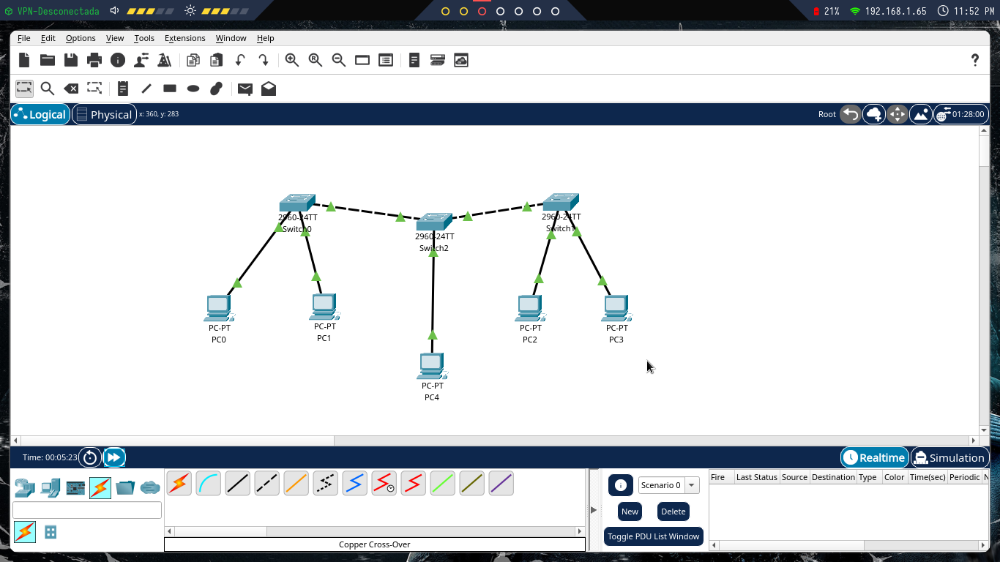
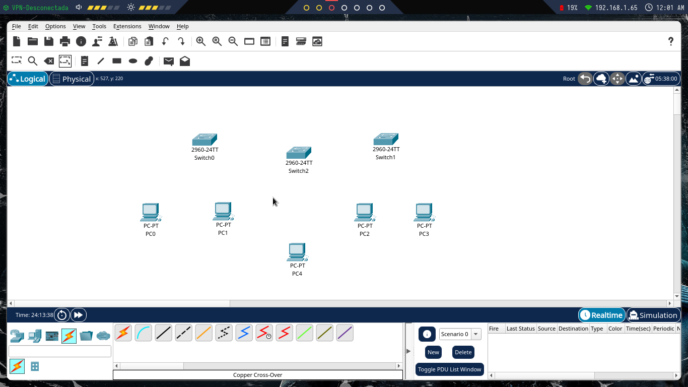
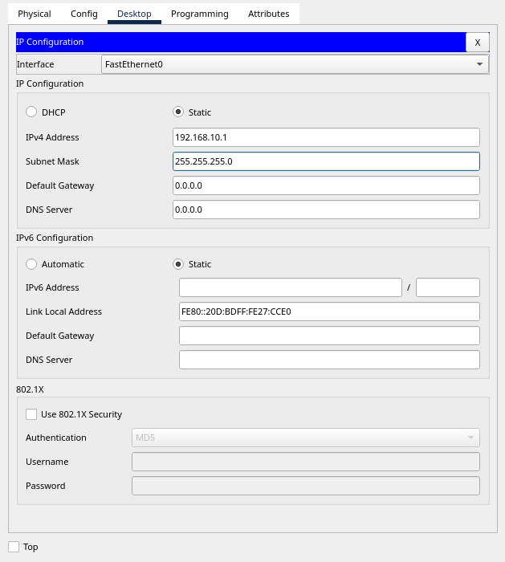
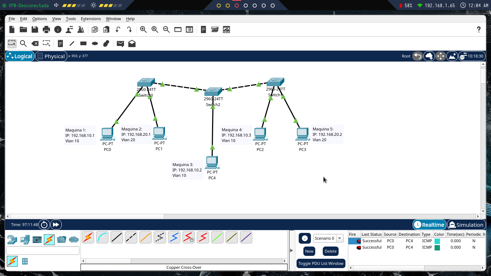

Packet Tracer de Cisco es un programa de simulación de redes que permite a los estudiantes experimentar con el comportamiento de la red

## Para comenzar tomamos 3 switches 2960 y 5 computadoras de escritorio



Continuamos conectando las computadoras a los switches por medio de cables directos y de switch a switch con cable cruzado, recordemos conectar las computadoras a las primeras interfaces del switch y cuando conectemos a switch a las ultimas, ejemplo maquina_1 conectada a FastEthernet0/01 y switch a switch FastEthernet0/24 a FastEthernet0/24, esto para tener unas concecciones mas ordenadas.


Una vez conectados nuestros equipos procedemos a configurar cada switch

## Comandos de configuracion de interface en switch para el modo trunkal (switch a switch)

```bash

enable
configure terminal 
vlan 10 
name vlan10
exit
vlan 20
name vlan20
interface FastEthernet0/24 
switchport mode acces
switchport mode trunk 
exit
 
```
Para este caso creamos dos vlans (vlan 10, vlan 20), Fundamental para cuando queremos aislar dichos equipos por temas de seguridad

## Configuracion de interface en switch para el acceso a vlan de la computadora_1 (maquina a vlan)

```bash
enable
configure terminal
interface FastEthernet0/1
switchport mode acces
switchport acces vlan 10
exit

```

## Configuracion de interface en switch para el acceso a vlan de la computadora_2 (maquina a vlan) 
```bash
enable
configure terminal
interface FastEthernet0/2
switchport mode acces
switchport acces vlan 20
exit

```

Para este caso solo configuramos un switch y aun nos faltaria configurar los demas repitiendo los mismos comandos para cada una de las interfaces

## Una vez terminemos de configurar los demas switches, configuramos las ip de las computadoras 

Para ello nos vamos a la compuatdora -> Desktop -> ip-configuration y colocamos la ip con el segmento de red 10 para indicar que pertenece a la vlan vlan10 como lo que se muestra en la imagen 



Repetimos este proceso para cada una de las maquinas, recordando colocar su segmento de red a la vlan que pertencen

## Envio de paquetes para verificacion del correcto funcionamiento de la red 

Una ves terminemos de configurar dichas ip podemos enviar paquetes a maquinas que esten dentro de la misma vlan y rechazara a las que se encuentren en distinta vlan como se muestra a continuacion



En la parte inferior derecha podemos visualizar el envio de paquetes, fallidos y exitosos 

Y con esto tendriamos cubierta la configuracion de vlans con accesos trunkales,
En caso de que exista alguna duda puedes contactarme por [Telegram](https://t.me/GAMHERN)
